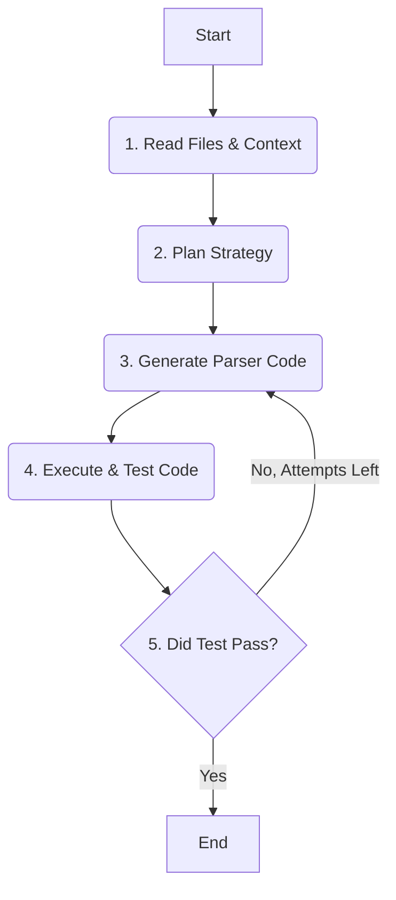

# Agent-as-Coder Challenge Submission

Hello! This is my submission for the "Agent-as-Coder" challenge. For this project, I built an autonomous AI agent capable of writing custom Python parsers for bank statement PDFs. My goal was to create a truly "agentic" system that could plan its work, generate code, test its own output, and learn from its mistakes through a self-correction loop.

## Agent Architecture & Flow

I designed the agent as a state machine using LangGraph. This allowed me to create a clear, cyclical workflow that mirrors how a human developer might tackle the problem. The agent's "thought process" follows these steps:

1.  **Read & Understand:** First, the agent reads the raw text from the sample PDF and analyzes the column structure of the target CSV.
2.  **Plan:** Using this context, it calls a language model to generate a high-level, step-by-step plan.
3.  **Code:** It then uses the plan to generate a complete Python parser script.
4.  **Test:** The agent saves this script and immediately executes it, comparing the output to the ground-truth CSV.
5.  **Refine or End:** If the test passes, the job is done. If it fails, the agent feeds the error message back into its "Code" step and tries again, using the error to inform its next attempt.

This entire loop is visualized below:



## Running the Project

Here are the 5 steps to get everything running on a fresh machine.

1.  **Clone the Repository**
    ```bash
    git clone https://github.com/VishalsWorkspace/ai-agent-challenge.git
    cd ai-agent-challenge
    ```
2.  **Create & Activate Virtual Environment**
    ```bash
    python3 -m venv venv
    source venv/bin/activate
    ```
3.  **Install Dependencies**
    This project uses an editable install for robust imports.
    ```bash
    pip install -e .
    pip install -r requirements.txt
    ```
4.  **Set Up API Key**
    Create a `.env` file in the root directory and add your Google API key:
    ```
    GOOGLE_API_KEY="your_key_here"
    ```
5.  **Run the Agent & Tests**
    To see the AI agent in action as it attempts to build the parser:
    ```bash
    python agent.py --target icici
    ```
    To run the final passing test for the demo video:
    ```bash
    pytest
    ```

## Challenges & Learnings

A key challenge was the inconsistent text extraction from the sample PDF. My initial parsing attempts failed due to messy line breaks that merged transaction data with headers and footers.

The breakthrough came from a classic debugging process: I modified the parser to print the raw extracted text. This immediately showed me that the data the code was "seeing" was different from what I expected. This discovery led me to build a more robust parser using `re.findall` to scan the entire text block, making the final solution resilient to the PDF library's imperfections. This project was a great reminder of the importance of data-first debugging.

## Potential Improvements

- **Smarter Self-Correction:** If the agent fails multiple times with the same `DataFrame shape mismatch` error, it could be programmed to automatically try a different parsing strategy (e.g., switch from a regex-based approach to a delimiter-splitting approach).
- **Expanded Toolset:** The agent could be given more tools, such as the ability to search online for parsing examples for a specific bank's statement format, making it even more autonomous and powerful.