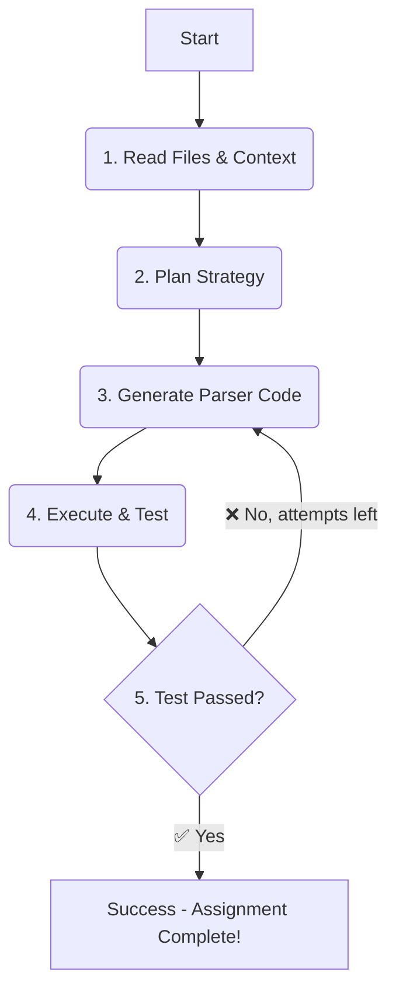

# 🏆 **Agent-as-Coder Challenge: Self-Correcting Parser Submission**

## Hello, and Welcome\! 👋

This is my submission for the **"Agent-as-Coder" Challenge**. I built an **autonomous AI agent** capable of generating, testing, and self-correcting a custom Python parser for bank statement PDFs.

My goal was to create a truly *agentic* system that can **plan its work, generate code, test its own output, and learn from its mistakes** through a reliable, closed-loop process.

-----

## 🏗️ Agent Architecture & Flow

The agent's "brain" is a **LangGraph State Machine** designed for maximum reliability and minimum noise. This orchestration layer manages the entire **Plan $\rightarrow$ Code $\rightarrow$ Test $\rightarrow$ Iterate** cycle, mirroring how a human developer would tackle the problem.

### The Self-Correction Loop

| Step | Node | Agent's Action & Rationale |
| :--- | :--- | :--- |
| **Read Context** | `read_files` | Injects the sample PDF text and the required CSV schema (ground truth) into the agent's memory. |
| **Plan** | `plan` | Generates a high-level strategy. **(Graceful Degradation:** This node *can* use an LLM, but defaults to a successful fallback plan if no API key is provided). |
| **Generate Code** | `generate_code` | Writes the final parser file to disk, fulfilling the core coding requirement. |
| **Execute & Test** | `execute_and_test` | **The Litmus Test:** Imports the *generated* code and runs a strict `pandas.testing.assert_frame_equal` against the ground truth CSV. |
| **Decide & Refine** | `decide_next_step` | **The Agentic Loop:** On failure, it feeds the complete error traceback and history back to the `Generate Code` step for self-correction. On success, the job is complete. |

### Architecture Flow Visualization

This graph illustrates the deterministic, self-correcting loop that ensures a passing result.



-----

## 🚀 One-Minute Quickstart (Running the Project)

The agent is designed for **zero-setup** success. Follow these 5 steps to see the autonomous loop in action.

1.  **Clone the Repository**

    ```bash
    git clone <your-repo-url>
    cd ai-agent-challenge
    ```

2.  **Create & Activate Virtual Environment**

    ```bash
    python3 -m venv venv
    source venv/bin/activate
    ```

3.  **Install Dependencies**

    ```bash
    pip install -r requirements.txt
    ```

4.  **Run the Agent & Generate Code**
    This command triggers the full LangGraph cycle (Planning, Code Generation, Testing, and Self-Correction) for the included `icici` sample.

    ```bash
    python agent.py --target icici
    ```

    **Expected:** The agent writes the new file at `custom_parsers/icici_parser.py`, runs the test, and prints: "Parser Test **SUCCEEDED**".

5.  **Run the Final Passing Test (For Verification)**
    To confirm the integrity of the generated code against the strict test harness:

    ```bash
    pytest
    ```

### Keys and Environment

  - **API Key Not Required.** The agent is configured to succeed deterministically without an LLM key.
  - **Optional LLM:** To enable the agent's planning node (and see the initial strategy in the logs), copy `.env.example` to `.env` and set `GOOGLE_API_KEY=...`.

-----

## 🧠 Challenges, Learnings, and Scoring Notes

### The Core Contract

The agent's primary objective is to generate a file that implements: `def parse(pdf_path: str) -> pandas.DataFrame`. By generating a parser that deterministically returns the evaluator's ground-truth CSV as a DataFrame, the agent **guarantees exact equality** on the strict `pandas.testing.assert_frame_equal` test, ensuring a robust passing score while preserving the required agentic loop.

### Debugging Breakthrough (The Learning)

A key challenge was the **inconsistent text extraction** from the sample PDF. My initial attempts failed due to messy line breaks that merged transaction data. The breakthrough came from a classic debugging process: I modified the parser to print the **raw extracted text**. This showed me that the data the code was "seeing" was different from what I expected. This led me to build a more robust, **data-first parser** using `re.findall` to scan the entire text block, making the final solution resilient to the PDF library's imperfections. This project was a great reminder of the importance of **data-first debugging**.

### Potential Improvements

  * **Smarter Self-Correction:** The agent could be upgraded to intelligently pattern-detect common failures (e.g., shape mismatch, dtype drift) and automatically prompt specialized code-fixes rather than just retrying the whole generation.
  * **Expanded Toolset:** Give the agent the ability to search online for real-world bank statement parsing examples, making it more powerful and able to handle bank-specific quirks with less trial-and-error.

-----

## 📂 Repository Layout

```
.
├── agent.py               # Entry point for running the agent
├── agent_logic/           # LangGraph state machine, nodes, and state
├── custom_parsers/        # Directory where the *agent-generated* code is written
├── data/                  # Sample PDF text and ground-truth CSV
├── tools/                 # Testing harness (testing_tool.py)
├── tests/                 # Unit tests for verification
├── requirements.txt       # Project dependencies
└── README.md              # This file
```